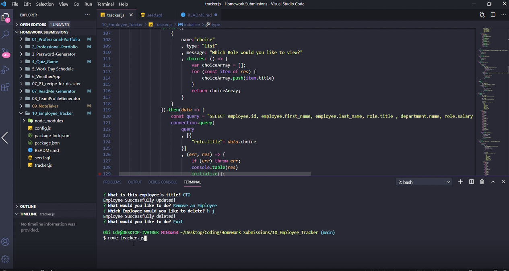

# 10_Employee_Tracker

* [Acceptance Criteria](#acceptancecriteria)
* [Installation](#installation)
* [Project Status](#projectstatus)
* [License](#license)
* [Deployment](#deployment)
* [Usage](#usage)
* [Preview of the App](#previewApp)

# Employee_Tracker

For this project, I aim to create an Employee Tracker application that can be used to track the organization's employees.  This application will use MySQL, InquirerJs, and console.table dependencies to make the app function. My main motivation for this project is to create an application that will allow employers to successfully track their employees and view their information by department and role. 

# Acceptance Criteria
Build a command-line application that at a minimum allows the user to:
* Add departments, roles, employees
* View departments, roles, employees
* Update employee roles

# Installation
In order to use this app, you will need to install MySQL, InquirerJs, and console.table. 

# Project Status
This project was completed on April 24, 2021. 

# License
MIT

# Deployment
[Link](https://drive.google.com/file/d/1O19XE915vSMxjYLlFQsY-bE4j2_3muhJ/view?usp=sharing)

# Usage
When you open the terminal, you will be able to view all employees, view employees by department and by role, view all departments, add new employees and new Departments, update an employee's information and remove employees. 

Add screenShot
# Preview of the App
* This is how the app looks
